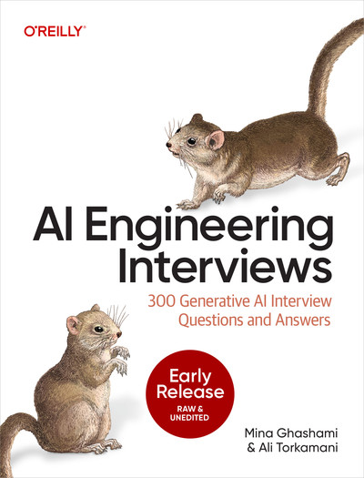

# AI Engineering Interviews

  

Welcome to the companion website for *AI Engineering Interviews*.

*AI Engineering Interviews* is a practical guide to preparing for modern AI engineering and generative AI interviews.

## Prerequisite Chapters

- [Math Foundations for AI Engineering](prerequisites/math-prerequisite.html)
- [PyTorch Tutorial for AI Engineering](prerequisites/pytorch-tutorial.html)

## Code

Code examples are available in the [`book-code`](https://github.com/AIEngineeringInterviews/book-code) repository.
