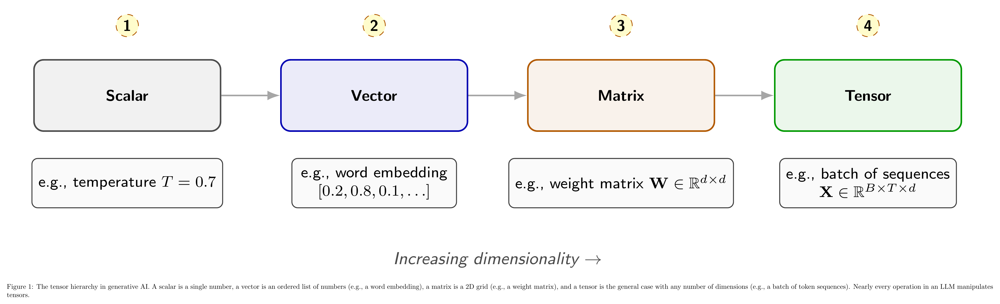
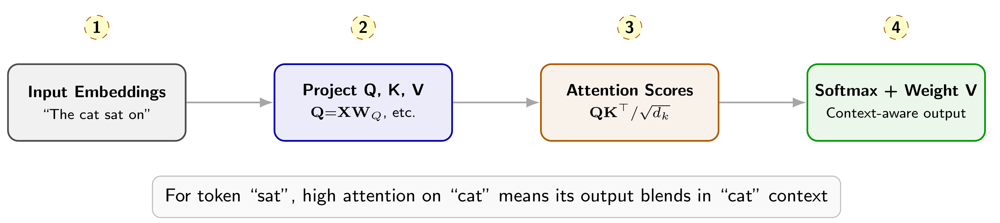
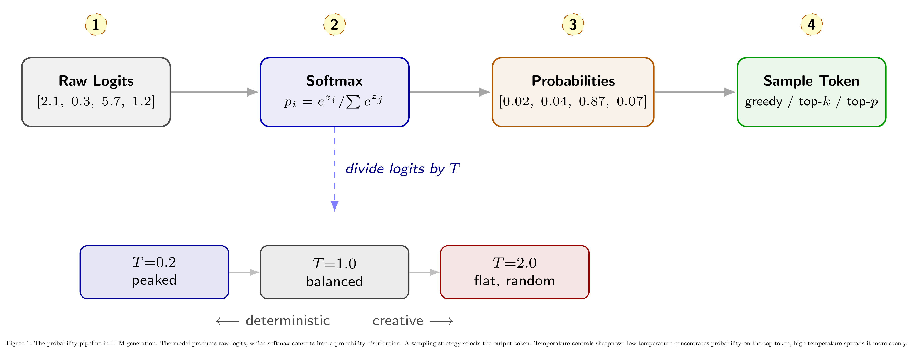
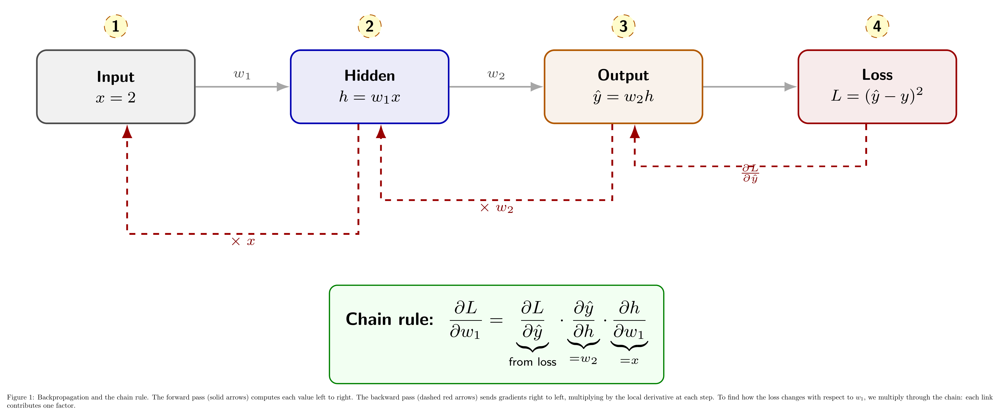

# Math Foundations for Generative AI

Every operation an LLM performs, from understanding your question to generating each word of its response, is a mathematical operation. There is no magic behind the curtain, just well-orchestrated math. When a model decides that "mat" is the most likely next word after "the cat sat on the," it has computed dot products, applied a softmax function, and sampled from a probability distribution. When the model learned to make that prediction in the first place, calculus drove every weight update.

Three mathematical pillars support generative AI:

- **Linear algebra** provides the language of representation. Words become vectors, transformations become matrix multiplications, and attention becomes a sequence of dot products.
- **Probability and statistics** govern prediction. An LLM is fundamentally a probability machine: given a sequence of tokens, it estimates a distribution over what comes next.
- **Calculus and optimization** power learning. Derivatives tell the model how to adjust its parameters, and the chain rule makes it possible to propagate that signal through billions of weights.

This chapter builds the mathematical intuition you need for generative AI interviews. Each section connects formulas to concrete LLM behavior, so you can explain not just *what* the math says, but *why* it matters.

## Linear Algebra: The Language of Representation

Before an LLM can process a sentence, it must convert words into numbers. Linear algebra provides the framework for this conversion and for every transformation that follows.

### Scalars, Vectors, Matrices, and Tensors

A *scalar* is a single number, like a temperature parameter $T = 0.7$. A *vector* is an ordered list of numbers: word embeddings, for instance, represent each token as a vector in $\mathbb{R}^d$ where $d$ might be 768 or 4096. A *matrix* is a 2D grid of numbers: the weight matrices inside a transformer layer are matrices in $\mathbb{R}^{d \times d}$. A *tensor* generalizes all of these to any number of dimensions: a batch of token sequences forms a 3D tensor in $\mathbb{R}^{B \times T \times d}$, where $B$ is the batch size, $T$ is the sequence length, and $d$ is the embedding dimension.

Figure 1 illustrates this hierarchy. Nearly every operation inside an LLM manipulates tensors.

*Figure 1. The tensor hierarchy in generative AI. A scalar is a single number, a vector is an ordered list of numbers (e.g., a word embedding), a matrix is a 2D grid (e.g., a weight matrix), and a tensor is the general case with any number of dimensions (e.g., a batch of token sequences). Nearly every operation in an LLM manipulates tensors.*

### Dot Products and Similarity

The *dot product* of two vectors $\mathbf{a}$ and $\mathbf{b}$ is defined as:

$$
\mathbf{a} \cdot \mathbf{b} = \sum_{i=1}^{d} a_i \, b_i
$$

In plain English, you multiply corresponding elements and add them up. The result is a single number that measures how similar two vectors are: if both vectors point in roughly the same direction, the dot product is large and positive; if they point in opposite directions, it is large and negative; if they are perpendicular (unrelated), it is close to zero.

This is exactly how attention works. When the model computes attention scores, it takes the dot product between a query vector and each key vector. A high score means "this token is relevant to the query."

### Matrix Multiplication as Transformation

Multiplying a matrix $\mathbf{W} \in \mathbb{R}^{m \times n}$ by a vector $\mathbf{x} \in \mathbb{R}^n$ produces a new vector $\mathbf{y} \in \mathbb{R}^m$:

$$
\mathbf{y} = \mathbf{W}\mathbf{x}
$$

Each element of $\mathbf{y}$ is a dot product between one row of $\mathbf{W}$ and the input $\mathbf{x}$. This single operation projects the input into a different representation space. In a transformer, every linear layer (the Q, K, V projections, the feed-forward layers, the output projection) is a matrix multiplication.

When you process an entire sequence at once, the input becomes a matrix $\mathbf{X} \in \mathbb{R}^{T \times d}$ (one row per token), and the transformation becomes $\mathbf{Y} = \mathbf{X}\mathbf{W}$, a matrix-matrix multiplication that processes all tokens simultaneously.

### The Mathematics of Self-Attention

Self-attention is where linear algebra converges in the most elegant way inside a transformer. Given input embeddings $\mathbf{X}$, the model computes three matrices through learned projections:

$$
\mathbf{Q} = \mathbf{X}\mathbf{W}_Q, \qquad \mathbf{K} = \mathbf{X}\mathbf{W}_K, \qquad \mathbf{V} = \mathbf{X}\mathbf{W}_V
$$

Here $\mathbf{Q}$ (queries) represents "what am I looking for," $\mathbf{K}$ (keys) represents "what do I contain," and $\mathbf{V}$ (values) represents "what information do I carry." The attention output is:

$$
\text{Attention}(\mathbf{Q}, \mathbf{K}, \mathbf{V}) = \text{softmax}\!\left(\frac{\mathbf{Q}\mathbf{K}^\top}{\sqrt{d_k}}\right) \mathbf{V}
$$

Breaking this down step by step: $\mathbf{Q}\mathbf{K}^\top$ computes pairwise dot products between every query and every key, producing a $T \times T$ score matrix. Dividing by $\sqrt{d_k}$ prevents the dot products from growing too large (which would push softmax into regions with near-zero gradients). Softmax normalizes each row into a probability distribution. Finally, multiplying by $\mathbf{V}$ produces a weighted combination of value vectors: each output token is a blend of all input tokens, weighted by relevance.

Figure 2 traces this computation with a concrete example.

*Figure 2. The mathematics of self-attention. Input embeddings are projected into queries ($\mathbf{Q}$), keys ($\mathbf{K}$), and values ($\mathbf{V}$). Attention scores are computed as scaled dot products $\mathbf{Q}\mathbf{K}^\top / \sqrt{d_k}$, then softmax normalizes them into weights that produce a context-aware combination of values.*

> **Interview takeaway:**
>
> If asked "explain self-attention mathematically," walk through $\mathbf{Q}\mathbf{K}^\top / \sqrt{d_k} \rightarrow \text{softmax} \rightarrow \times \mathbf{V}$ step by step. Show you can connect each matrix operation to what the model is actually doing: measuring relevance, normalizing, and blending information.

### Norms

A *norm* measures the magnitude (length) of a vector. The two most common norms are:
- **L2 norm** (Euclidean): $\|\mathbf{x}\|_2 = \sqrt{\sum_i x_i^2}$. Used in cosine similarity, weight decay, and layer normalization.
- **L1 norm** (Manhattan): $\|\mathbf{x}\|_1 = \sum_i |x_i|$. Encourages sparsity when used as a regularizer.

Cosine similarity, which normalizes vectors by their L2 norm before taking the dot product, is widely used in embedding search and retrieval:

$$
\text{cos\_sim}(\mathbf{a}, \mathbf{b}) =
\frac{\mathbf{a} \cdot \mathbf{b}}
{\|\mathbf{a}\|_2 \, \|\mathbf{b}\|_2}
$$

### Eigenvalues and Eigenvectors

An *eigenvector* of a matrix $\mathbf{A}$ is a vector $\mathbf{v}$ that, when multiplied by $\mathbf{A}$, only gets scaled: $\mathbf{A}\mathbf{v} = \lambda \mathbf{v}$, where $\lambda$ is the *eigenvalue*. Eigenvectors reveal the principal directions of a transformation. In practice, they appear in PCA (dimensionality reduction for embeddings) and in analyzing the stability of optimization (the eigenvalues of the Hessian matrix indicate how curved the loss landscape is).

## Probability and Statistics: Predicting the Next Token

At its core, a language model estimates a conditional probability distribution: given a sequence of tokens $x_1, x_2, \ldots, x_{t-1}$, what is the probability of each possible next token $x_t$? Probability theory provides the framework for this prediction, for the loss function that trains the model, and for the sampling strategies that generate text.

### Probability Distributions

A *probability distribution* assigns a probability to each possible outcome such that all probabilities sum to 1. For an LLM with vocabulary size $V$, the output at each time step is a *categorical distribution* over $V$ tokens: $P(x_t = v \mid x_{<t})$ for each $v$ in the vocabulary. The model must assign high probability to plausible next tokens and low probability to implausible ones.

### Conditional Probability and the Chain Rule

The probability of an entire sequence decomposes via the chain rule of probability:

$$
P(x_1, x_2, \ldots, x_T) = P(x_1) \cdot P(x_2 \mid x_1) \cdot P(x_3 \mid x_1, x_2) \cdots P(x_T \mid x_{<T})
$$

This is exactly what autoregressive (GPT-style) language models compute: each token's probability is conditioned on all previous tokens. Training the model to predict each $P(x_t \mid x_{<t})$ accurately is the objective of *causal language modeling*.

### Maximum Likelihood Estimation

How do we train the model? By finding parameters $\theta$ that maximize the likelihood of the training data:

$$
\theta^* = \arg\max_\theta \prod_{t=1}^{T} P_\theta(x_t \mid x_{<t})
$$

Taking the logarithm (which is monotonic, so it preserves the maximum) and flipping the sign gives us a *minimization* problem:

$$
\mathcal{L}(\theta) = -\sum_{t=1}^{T} \log P_\theta(x_t \mid x_{<t})
$$

This is the negative log-likelihood, and it is equivalent to the cross-entropy loss that every LLM minimizes during training.

### Information Theory

Three quantities from information theory appear repeatedly in generative AI:

**Entropy** measures uncertainty. For a distribution $P$:

$$
H(P) = -\sum_x P(x) \log P(x)
$$

High entropy means the model is uncertain (probability spread across many tokens); low entropy means the model is confident. A perfectly confident model (all probability on one token) has entropy zero.

**Cross-entropy** measures the gap between a predicted distribution $Q$ and the true distribution $P$:

$$
H(P, Q) = -\sum_x P(x) \log Q(x)
$$

When $P$ is the one-hot true label (the actual next token), cross-entropy simplifies to $-\log Q(x_{\text{true}})$, which is exactly the per-token training loss. Minimizing cross-entropy is equivalent to maximizing the probability assigned to the correct token.

**KL divergence** measures how one distribution $Q$ differs from a reference distribution $P$:

$$
D_{\text{KL}}(P \| Q) = \sum_x P(x) \log \frac{P(x)}{Q(x)}
$$

KL divergence is always non-negative and equals zero only when $P = Q$. It appears in RLHF (penalizing the policy from drifting too far from the reference model), in VAE training (regularizing the latent space), and in knowledge distillation (matching the student's distribution to the teacher's). Note that KL divergence is not symmetric: $D_{\text{KL}}(P \| Q) \neq D_{\text{KL}}(Q \| P)$ in general.

> **Interview takeaway:**
>
> Cross-entropy, KL divergence, and softmax appear in almost every generative AI interview. Be ready to write the formulas and explain what each term means in plain English. The connection between them: cross-entropy $= $ entropy $+$ KL divergence, which is why minimizing cross-entropy also minimizes the gap between predicted and true distributions.

### The Softmax Function

Softmax converts a vector of raw scores (logits) $\mathbf{z} \in \mathbb{R}^V$ into a valid probability distribution:

$$
\text{softmax}(z_i) = \frac{e^{z_i}}{\sum_{j=1}^{V} e^{z_j}}
$$

The exponential ensures all values are positive; the denominator normalizes them to sum to 1. Larger logits get exponentially larger probabilities, which creates a "winner-take-more" dynamic.

### Temperature Scaling

A *temperature* parameter $T$ can be applied before softmax to control the sharpness of the distribution:

$$
\text{softmax}(z_i / T) = \frac{e^{z_i / T}}{\sum_{j=1}^{V} e^{z_j / T}}
$$

When $T < 1$, the distribution becomes sharper (more confident, less diverse). When $T > 1$, it becomes flatter (more random, more diverse). At $T \to 0$, softmax approaches a one-hot vector on the argmax (greedy decoding). At $T \to \infty$, it approaches a uniform distribution.

### Sampling Strategies

Once softmax produces a probability distribution, a *sampling strategy* selects the output token:
- **Greedy decoding**: always pick the highest-probability token. Deterministic but can produce repetitive text.
- **Top-$k$ sampling**: restrict sampling to the $k$ highest-probability tokens, then renormalize. Controls diversity by limiting the candidate set.
- **Top-$p$ (nucleus) sampling**: include tokens until their cumulative probability exceeds a threshold $p$ (e.g., $p = 0.95$), then renormalize. Adapts the candidate set size to the model's confidence: fewer candidates when confident, more when uncertain.

Figure 3 traces this pipeline from raw logits to a sampled token, with concrete numbers.

*Figure 3. The probability pipeline in LLM generation. The model produces raw logits, which softmax converts into a probability distribution. A sampling strategy selects the output token. Temperature controls sharpness: low temperature concentrates probability on the top token, high temperature spreads it more evenly.*

## Calculus: How Models Learn

Probability tells the model what to predict. Linear algebra provides the representation. But how does the model improve? Calculus provides the answer: derivatives measure how the loss changes when you adjust a parameter, and the chain rule propagates that signal through an entire network.

### Derivatives and Gradients

The *derivative* $\frac{df}{dx}$ measures the rate of change of a function $f$ with respect to $x$. For a function of many variables (like a loss function depending on millions of weights), the *gradient* $\nabla_\theta \mathcal{L}$ is a vector of partial derivatives, one per parameter. The gradient points in the direction of steepest *ascent*, so to minimize the loss, we move in the opposite direction:

$$
\theta_{t+1} = \theta_t - \alpha \, \nabla_\theta \mathcal{L}(\theta_t)
$$

Here $\alpha$ is the *learning rate*, which controls the step size. Too large and training diverges; too small and training stalls.

### The Chain Rule

Neural networks are compositions of functions: $f(x) = f_n(\ldots f_2(f_1(x)))$. To compute the gradient of the loss with respect to parameters deep inside the network, we need the *chain rule*:

$$
\frac{\partial L}{\partial w_1} = \frac{\partial L}{\partial f_n} \cdot \frac{\partial f_n}{\partial f_{n-1}} \cdots \frac{\partial f_2}{\partial f_1} \cdot \frac{\partial f_1}{\partial w_1}
$$

Each factor is a local derivative: how does this layer's output change when its input changes? The chain rule multiplies them all together to compute how the final loss changes when an early parameter changes. This is the mathematical engine of deep learning.

### Backpropagation

*Backpropagation* is the algorithm that efficiently computes gradients using the chain rule. It works in two passes:

1. **Forward pass**: compute the output and loss, caching intermediate values at each layer.
1. **Backward pass**: starting from the loss, compute gradients layer by layer using the chain rule, working from output toward input.

Figure 4 walks through backpropagation on a simple network with actual numbers, showing how each gradient is computed by multiplying the upstream gradient by the local derivative.

*Figure 4. Backpropagation and the chain rule. The forward pass (solid arrows) computes each value left to right. The backward pass (dashed red arrows) sends gradients right to left, multiplying by the local derivative at each step. To find how the loss changes with respect to $w_1$, we multiply through the chain: each link contributes one factor.*

> **Interview takeaway:**
>
> When asked about backpropagation, start with the chain rule. Show you understand that backprop is just repeated application of the chain rule from the output layer back to the input layer. The forward pass computes the values; the backward pass computes the gradients.

### Vanishing and Exploding Gradients

When the chain of multiplied derivatives contains many factors less than 1, the gradient *vanishes* (approaches zero), starving early layers of learning signal. When factors are greater than 1, the gradient *explodes* (grows uncontrollably). Both problems become worse as networks get deeper.

Modern architectures address this with **residual connections** (adding the input to the output of each layer, providing a gradient shortcut), **layer normalization** (stabilizing the scale of activations), and **gradient clipping** (capping the maximum gradient magnitude). The ML Foundations chapter covers these techniques in detail.

### Partial Derivatives and the Jacobian

When a function maps a vector to a vector ($\mathbf{f}: \mathbb{R}^n \to \mathbb{R}^m$), the *Jacobian matrix* $\mathbf{J} \in \mathbb{R}^{m \times n}$ contains all partial derivatives: $J_{ij} = \partial f_i / \partial x_j$. In backpropagation through layers with multi-dimensional inputs and outputs, the chain rule involves multiplying Jacobian matrices rather than scalars. Modern deep learning frameworks (PyTorch, JAX) handle this automatically through *automatic differentiation*.

## Putting It Together: Math in the LLM Pipeline

Here is how the three mathematical pillars connect in a single forward pass through a transformer:

1. **Token embedding** (matrix indexing): each input token ID selects a row from the embedding matrix $\mathbf{E} \in \mathbb{R}^{V \times d}$, producing an embedding vector.
1. **Positional encoding** (vector addition): position information is added to each embedding, giving the model a sense of word order.
1. **Self-attention** (dot products + softmax): $\mathbf{Q}$, $\mathbf{K}$, $\mathbf{V}$ projections via matrix multiplication, attention scores via scaled dot products, softmax normalization, and weighted combination of values.
1. **Feed-forward network** (two matrix multiplications with activation): each token passes through a two-layer MLP that expands the representation, applies a non-linearity (GELU or SiLU), and projects back down.
1. **Output projection** (matrix multiplication): the final hidden state is projected into logit space $\mathbb{R}^V$, one score per vocabulary token.
1. **Softmax and sampling** (probability): logits become a probability distribution over the vocabulary, and a sampling strategy selects the next token.

Steps 3 and 4 repeat for each transformer layer (modern LLMs have 32 to 128 layers), with residual connections and layer normalization at each step.

During training, the process continues: the loss (cross-entropy between predicted distribution and actual next token) is computed, and backpropagation sends gradients through every layer, adjusting all weight matrices to improve the next prediction.

## Notation Reference

For reference, here is the mathematical notation used throughout this book:

- **Scalars**: italic lowercase ($x$, $\alpha$, $T$, $d_k$)
- **Vectors**: bold lowercase ($\mathbf{x}$, $\mathbf{q}$, $\mathbf{v}$)
- **Matrices**: bold uppercase ($\mathbf{W}$, $\mathbf{Q}$, $\mathbf{K}$, $\mathbf{V}$, $\mathbf{X}$)
- **Sets**: calligraphic ($\mathcal{D}$ for dataset, $\mathcal{V}$ for vocabulary)
- **Distributions**: $P$, $Q$ for probability distributions; $\pi$ for policies (in RL context)
- **Gradient**: $\nabla_\theta \mathcal{L}$ denotes the gradient of loss $\mathcal{L}$ with respect to parameters $\theta$
- **Norms**: $\|\mathbf{x}\|_2$ for L2 (Euclidean), $\|\mathbf{x}\|_1$ for L1 (Manhattan)
- **Common operations**: $\odot$ for element-wise multiplication (Hadamard product), $\otimes$ for outer product, $\top$ for transpose
- **Dimensions**: $B$ (batch size), $T$ (sequence length), $d$ (embedding dimension), $V$ (vocabulary size), $d_k$ (key/query dimension), $d_v$ (value dimension)

> **Note:** Using clean, consistent notation in interviews demonstrates a deep understanding of the mathematics behind generative AI. However, it is equally important to be able to explain every formula in plain English. The best interviewees move fluidly between formal notation and intuitive explanation.

## Interview Questions and Answers

### Thread 1: Linear Algebra Foundations

#### Question 1. What is a tensor, and how do scalars, vectors, and matrices relate to it?

A *tensor* is a generalization of scalars, vectors, and matrices to any number of dimensions. A scalar is a 0-dimensional tensor (a single number, like a learning rate $\alpha = 0.001$). A vector is a 1-dimensional tensor (an ordered list of numbers, like a word embedding $\mathbf{e} \in \mathbb{R}^{768}$). A matrix is a 2-dimensional tensor (a grid of numbers, like a weight matrix $\mathbf{W} \in \mathbb{R}^{768 \times 768}$). A tensor extends this pattern to 3 or more dimensions.

In practice, LLMs work with 3D and 4D tensors constantly. A batch of token sequences has shape $(B, T, d)$: $B$ is the batch size (how many sequences), $T$ is the sequence length (how many tokens), and $d$ is the embedding dimension (how many numbers represent each token). Multi-head attention introduces a fourth dimension for the number of heads: $(B, H, T, d_k)$.

The key insight is that tensors provide a unified mathematical framework. Whether you are looking at a single embedding, a weight matrix, or an entire batch of attention scores, the operations (addition, multiplication, reshaping) follow the same rules, just extended to more dimensions.

#### Question 2. You mentioned vectors represent words. How do dot products measure similarity between word embeddings?

The *dot product* of two vectors $\mathbf{a}$ and $\mathbf{b}$ is $\mathbf{a} \cdot \mathbf{b} = \sum_{i} a_i b_i$. Geometrically, it equals $\|\mathbf{a}\| \, \|\mathbf{b}\| \cos\theta$, where $\theta$ is the angle between the vectors. When two vectors point in similar directions ($\theta$ is small), $\cos\theta$ is close to 1 and the dot product is large. When they are orthogonal (unrelated), $\cos\theta = 0$.

For word embeddings, this means semantically similar words have high dot products. If "king" and "queen" have similar embedding vectors, their dot product will be large, reflecting their semantic relatedness.

In practice, we often normalize by vector magnitudes to get *cosine similarity*: $\text{cos_sim}(\mathbf{a}, \mathbf{b}) = \mathbf{a} \cdot \mathbf{b} / (\|\mathbf{a}\|_2 \|\mathbf{b}\|_2)$, which ranges from $-1$ (opposite) to $+1$ (identical direction). This is the standard similarity metric in embedding search, retrieval-augmented generation, and recommendation systems.

The attention mechanism uses raw (unnormalized) dot products between query and key vectors: $\mathbf{q} \cdot \mathbf{k}$ measures how relevant key token $k$ is to query token $q$. Higher dot product means higher attention weight.

#### Question 3. Beyond similarity, how does matrix multiplication work in neural networks?

Matrix multiplication is the workhorse of neural networks. When you multiply a weight matrix $\mathbf{W} \in \mathbb{R}^{m \times n}$ by an input vector $\mathbf{x} \in \mathbb{R}^n$, you get an output vector $\mathbf{y} = \mathbf{W}\mathbf{x} \in \mathbb{R}^m$. Each element of $\mathbf{y}$ is a dot product between one row of $\mathbf{W}$ and the input. So a single matrix multiplication computes $m$ dot products in parallel, projecting the input into a new representation space.

Every linear layer in a transformer is a matrix multiplication. The query, key, and value projections ($\mathbf{Q} = \mathbf{X}\mathbf{W}_Q$) are matrix multiplications. The feed-forward network applies two matrix multiplications with a non-linearity in between. The output projection from hidden states to logits is a matrix multiplication.

When processing a sequence, the input is a matrix $\mathbf{X} \in \mathbb{R}^{T \times d}$ (one row per token), and the transformation $\mathbf{Y} = \mathbf{X}\mathbf{W}$ processes all tokens simultaneously. This is why transformers are so GPU-friendly: matrix multiplication is highly parallelizable and GPUs are specifically optimized for it.

One important property: matrix multiplication is *not* commutative ($\mathbf{A}\mathbf{B} \neq \mathbf{B}\mathbf{A}$ in general), but it *is* associative ($(\mathbf{A}\mathbf{B})\mathbf{C} = \mathbf{A}(\mathbf{B}\mathbf{C})$). The associative property is exploited in techniques like LoRA, where a large weight update is factored into two smaller matrices: $\Delta\mathbf{W} = \mathbf{B}\mathbf{A}$ with $\mathbf{B} \in \mathbb{R}^{d \times r}$ and $\mathbf{A} \in \mathbb{R}^{r \times d}$, where $r \ll d$.

#### Question 4. Walk me through the attention mechanism mathematically.

Self-attention computes a context-aware representation for each token by allowing it to "attend" to all other tokens. Here is the step-by-step computation:

**Step 1: Project into Q, K, V.** Given input embeddings $\mathbf{X} \in \mathbb{R}^{T \times d}$, compute:

$$
\mathbf{Q} = \mathbf{X}\mathbf{W}_Q,      \mathbf{K} = \mathbf{X}\mathbf{W}_K,      \mathbf{V} = \mathbf{X}\mathbf{W}_V
$$

where $\mathbf{W}_Q, \mathbf{W}_K \in \mathbb{R}^{d \times d_k}$ and $\mathbf{W}_V \in \mathbb{R}^{d \times d_v}$. Queries represent "what am I looking for," keys represent "what do I contain," and values represent "what information do I carry."

**Step 2: Compute attention scores.** Multiply queries by keys transposed:

$$
\mathbf{S} = \mathbf{Q}\mathbf{K}^\top \in \mathbb{R}^{T \times T}
$$

Entry $S_{ij}$ is the dot product between the query of token $i$ and the key of token $j$, measuring how relevant token $j$ is to token $i$.

**Step 3: Scale.** Divide by $\sqrt{d_k}$ to prevent large values from saturating softmax:

$$
\mathbf{S}_{\text{scaled}} = \frac{\mathbf{S}}{\sqrt{d_k}}
$$

Without this scaling, when $d_k$ is large (e.g., 64 or 128), dot products can be very large in magnitude, pushing softmax outputs to near-zero gradients.

**Step 4: Apply causal mask** (for decoder models). Set future positions to $-\infty$ so that token $i$ cannot attend to tokens $j > i$:

$$
S_{ij} = -\infty      \text{for } j > i
$$

**Step 5: Softmax.** Normalize each row into a probability distribution:

$$
\mathbf{A} = \text{softmax}(\mathbf{S}_{\text{scaled}}) \in \mathbb{R}^{T \times T}
$$

Row $i$ of $\mathbf{A}$ contains the attention weights for token $i$: how much it attends to each other token.

**Step 6: Weighted combination.** Multiply attention weights by values:

$$
\text{Output} = \mathbf{A}\mathbf{V} \in \mathbb{R}^{T \times d_v}
$$

Each output row is a weighted sum of value vectors, blending information from all attended tokens. Multi-head attention repeats this process $H$ times in parallel (with different $\mathbf{W}_Q, \mathbf{W}_K, \mathbf{W}_V$ per head), concatenates results, and projects back to $d$ dimensions.

The computational complexity is $O(T^2 \cdot d)$ for the $\mathbf{Q}\mathbf{K}^\top$ multiplication, which is why long sequences are expensive. Techniques like FlashAttention, grouped-query attention, and sparse attention address this bottleneck.

### Thread 2: Probability and Information Theory

#### Question 5. How does probability theory connect to language modeling?

A language model is, at its core, a probability estimator. Given a sequence of tokens $x_1, x_2, \ldots, x_{t-1}$, the model estimates a conditional probability distribution $P(x_t \mid x_1, \ldots, x_{t-1})$ over the entire vocabulary for the next token. The probability of a complete sentence is the product of these conditional probabilities:

$$
P(x_1, \ldots, x_T) = \prod_{t=1}^{T} P(x_t \mid x_{<t})
$$

This decomposition is the *chain rule of probability*, and it is the mathematical foundation of autoregressive language modeling. GPT-style models are trained to estimate each of these conditional distributions as accurately as possible.

When you prompt an LLM with "the cat sat on the," the model computes a probability distribution over all tokens in the vocabulary. It might assign $P(\text{"mat"}) = 0.35$, $P(\text{"floor"}) = 0.20$, $P(\text{"couch"}) = 0.12$, and so on. A sampling strategy then selects one token from this distribution, and the process repeats for the next token.

Every aspect of LLM behavior connects back to these probabilities: confident responses correspond to peaked distributions (one token has high probability), hedging or creativity correspond to flatter distributions, and hallucinations often occur when the model assigns moderate probability to plausible-sounding but incorrect tokens.

#### Question 6. You said LLMs predict $P(\text{next token} \mid \text{context})$. What is maximum likelihood estimation and how is it used in training?

*Maximum likelihood estimation* (MLE) is the principle behind LLM training: find model parameters $\theta$ that make the training data as probable as possible. Formally:

$$
\theta^* = \arg\max_\theta \prod_{t=1}^{T} P_\theta(x_t \mid x_{<t})
$$

In practice, we take the logarithm (turning the product into a sum) and negate it (turning maximization into minimization), giving us the *negative log-likelihood* loss:

$$
\mathcal{L}(\theta) = -\sum_{t=1}^{T} \log P_\theta(x_t \mid x_{<t})
$$

Each term $-\log P_\theta(x_t \mid x_{<t})$ measures how surprised the model is by the actual next token. If the model assigns probability 0.9 to the correct token, the loss is $-\log(0.9) \approx 0.105$ (small). If it assigns probability 0.01, the loss is $-\log(0.01) \approx 4.6$ (large). Training pushes the model to be less surprised by the training data.

This negative log-likelihood is mathematically identical to *cross-entropy loss* when the true distribution is a one-hot vector (all probability on the correct token). So when you see "cross-entropy loss" in LLM training, it is MLE by another name.

#### Question 7. What is cross-entropy and why is it the standard LLM training loss?

*Cross-entropy* between a true distribution $P$ and a predicted distribution $Q$ is:

$$
H(P, Q) = -\sum_{x} P(x) \log Q(x)
$$

For LLM training, the true distribution $P$ is a one-hot vector: probability 1 on the actual next token, probability 0 on everything else. This simplifies cross-entropy to $-\log Q(x_{\text{true}})$, which is the negative log probability the model assigned to the correct token.

Cross-entropy is the standard loss because of three properties:

1. It is equivalent to maximum likelihood estimation, which has strong theoretical guarantees.
1. Its gradient has a simple, well-behaved form: the gradient with respect to the logits is $(Q - P)$, the difference between predicted and true distributions. No exploding or vanishing gradient issues from the loss itself.
1. It connects directly to information theory. Cross-entropy decomposes as $H(P, Q) = H(P) + D_{\text{KL}}(P \| Q)$. Since $H(P)$ (the entropy of the true distribution) is constant, minimizing cross-entropy is equivalent to minimizing KL divergence between the true and predicted distributions.

In practice, cross-entropy is computed efficiently using the "log-softmax trick": instead of computing softmax and then taking the log, frameworks compute $\log(\text{softmax})$ in a numerically stable way using the log-sum-exp identity.

#### Question 8. You mentioned cross-entropy measures the distribution gap. How do entropy and KL divergence relate to that?

These three quantities form a family:

**Entropy** $H(P) = -\sum_x P(x) \log P(x)$ measures the intrinsic uncertainty in a distribution. For a uniform distribution over $V$ tokens, entropy is $\log V$ (maximum uncertainty). For a one-hot distribution, entropy is 0 (no uncertainty).

**KL divergence** $D_{\text{KL}}(P \| Q) = \sum_x P(x) \log \frac{P(x)}{Q(x)}$ measures the extra bits needed to encode data from $P$ using the code designed for $Q$. It is always $\geq 0$ and equals 0 only when $P = Q$.

**Cross-entropy** ties them together: $H(P, Q) = H(P) + D_{\text{KL}}(P \| Q)$.

Since $H(P)$ is fixed (it depends only on the data), minimizing cross-entropy is equivalent to minimizing KL divergence. This explains why cross-entropy is the right training objective: it pushes the model's predicted distribution $Q$ as close as possible to the true distribution $P$.

In generative AI beyond training loss, KL divergence appears in several places:
- **RLHF**: the KL penalty $D_{\text{KL}}(\pi_\theta \| \pi_{\text{ref}})$ prevents the fine-tuned model from deviating too far from the reference model.
- **Knowledge distillation**: the student model minimizes KL divergence between its output distribution and the teacher's output distribution.
- **VAEs**: the latent space is regularized by $D_{\text{KL}}(q(\mathbf{z}|\mathbf{x}) \| p(\mathbf{z}))$, pushing the encoder distribution toward a standard Gaussian prior.

One important subtlety: KL divergence is *not* symmetric. $D_{\text{KL}}(P \| Q)$ (forward KL) penalizes $Q$ for assigning low probability where $P$ is high (mode-seeking). $D_{\text{KL}}(Q \| P)$ (reverse KL) penalizes $Q$ for assigning high probability where $P$ is low (mode-covering). Different applications choose different directions depending on their goals.

### Thread 3: Softmax and Sampling

#### Question 9. How does the softmax function convert logits to probabilities?

After the final linear layer, the model produces a vector of *logits* $\mathbf{z} \in \mathbb{R}^V$, one score per vocabulary token. These logits can be any real number (positive, negative, large, small) and do not form a valid probability distribution. Softmax converts them:

$$
\text{softmax}(z_i) = \frac{e^{z_i}}{\sum_{j=1}^{V} e^{z_j}}
$$

The exponential function $e^{z_i}$ ensures all values become positive. The denominator normalizes them to sum to 1. Larger logits get exponentially larger probabilities, creating a "winner-take-more" effect.

A practical concern is numerical stability. If logits are very large (e.g., $z_i = 1000$), $e^{z_i}$ overflows. The standard trick is to subtract the maximum logit before exponentiating: $\text{softmax}(z_i) = e^{z_i - \max(\mathbf{z})} / \sum_j e^{z_j - \max(\mathbf{z})}$. This is mathematically equivalent but avoids overflow.

For a vocabulary of 50,000+ tokens, softmax is computed over all tokens at each decoding step. The computation is $O(V)$, which is manageable but becomes significant when multiplied by the sequence length and batch size.

#### Question 10. What is temperature and how does it affect the output distribution?

Temperature $T$ is a scalar that divides the logits before softmax:

$$
P(x_i) = \frac{e^{z_i / T}}{\sum_j e^{z_j / T}}
$$

It controls the "sharpness" of the probability distribution without changing which token has the highest probability:

- $T = 1$: the default, unmodified distribution.
- $T < 1$ (e.g., 0.2): dividing by a small number amplifies differences between logits. The distribution becomes sharper and more peaked. The model behaves more deterministically, almost always picking the top token. Useful for factual tasks, code generation, and structured output.
- $T > 1$ (e.g., 1.5): dividing by a large number compresses differences between logits. The distribution becomes flatter and more uniform. The model becomes more creative and diverse but also more prone to incoherent output. Useful for brainstorming and creative writing.
- $T \to 0$: approaches argmax (greedy decoding), selecting the highest-probability token with certainty.
- $T \to \infty$: approaches a uniform distribution, selecting tokens essentially at random.

Mathematically, temperature interacts with entropy: lowering $T$ decreases the entropy of the output distribution (less uncertainty), while raising $T$ increases it (more uncertainty). The optimal temperature depends on the task and is usually tuned empirically.

#### Question 11. Beyond temperature, what are top-$k$ and top-$p$ (nucleus) sampling?

Temperature adjusts the distribution shape, but top-$k$ and top-$p$ truncate it by removing unlikely tokens entirely.

**Top-$k$ sampling**: after computing the probability distribution, keep only the $k$ tokens with the highest probabilities and set everything else to zero. Renormalize the remaining $k$ probabilities to sum to 1, then sample. For example, with $k = 50$, the model chooses among its 50 best guesses. The limitation is that $k$ is fixed: when the model is very confident (one token dominates), $k = 50$ might still include irrelevant tokens. When the model is uncertain, $k = 50$ might cut off viable alternatives.

**Top-$p$ (nucleus) sampling**: instead of fixing the number of tokens, fix the cumulative probability threshold. Sort tokens by probability, then include tokens until their cumulative probability exceeds $p$ (e.g., $p = 0.95$). Renormalize and sample. This adapts the candidate set to the model's confidence: when the model is sure (one token has probability 0.98), the nucleus might contain just one token. When the model is uncertain (probabilities spread across many tokens), the nucleus expands.

These strategies can be combined: apply temperature first (to shape the distribution), then apply top-$k$ or top-$p$ (to truncate it). A common practical configuration is temperature 0.7 with top-$p$ = 0.95, which produces diverse but coherent text.

**Min-$p$ sampling** is a newer alternative: keep tokens whose probability is at least $p_{\min}$ times the highest probability. For example, if the top token has probability 0.4 and $p_{\min} = 0.1$, keep all tokens with probability $\geq 0.04$. This scales naturally with the model's confidence level.

### Thread 4: Calculus and Learning

#### Question 12. How do derivatives and gradients drive model training?

A derivative measures how much a function's output changes when you nudge its input. For a function $f(x)$, the derivative $f'(x)$ tells you the slope at point $x$: positive slope means increasing $x$ increases $f(x)$; negative slope means increasing $x$ decreases $f(x)$.

For LLM training, the function is the loss $\mathcal{L}(\theta)$ (a single number measuring how wrong the model is) and the inputs are the model's parameters $\theta$ (millions or billions of numbers). The *gradient* $\nabla_\theta \mathcal{L}$ is the vector of all partial derivatives, one per parameter:

$$
\nabla_\theta \mathcal{L} = \left[\frac{\partial \mathcal{L}}{\partial \theta_1}, \frac{\partial \mathcal{L}}{\partial \theta_2}, \ldots, \frac{\partial \mathcal{L}}{\partial \theta_n}\right]
$$

This gradient vector points in the direction of steepest increase of the loss. To reduce the loss, we move in the opposite direction:

$$
\theta_{t+1} = \theta_t - \alpha \, \nabla_\theta \mathcal{L}(\theta_t)
$$

where $\alpha$ is the learning rate. Each parameter gets its own partial derivative telling it exactly which direction to move and by how much. A parameter whose derivative is large has a big impact on the loss and gets a proportionally larger update.

The gradient is the mathematical signal that connects the model's mistakes (loss) to its parameters (weights). Without gradients, there would be no systematic way to improve the model.

#### Question 13. You mentioned gradients point toward steepest ascent. What is the chain rule and why is it central to deep learning?

The *chain rule* is the calculus rule for computing derivatives of composed functions. If $y = g(h(x))$, then:

$$
\frac{dy}{dx} = \frac{dg}{dh} \cdot \frac{dh}{dx}
$$

You multiply the derivative of the outer function by the derivative of the inner function. For a chain of three functions $y = f(g(h(x)))$:

$$
\frac{dy}{dx} = \frac{df}{dg} \cdot \frac{dg}{dh} \cdot \frac{dh}{dx}
$$

A neural network is exactly this: a chain of composed functions. Each layer transforms the previous layer's output. A 32-layer transformer is a composition of 32 functions (plus sub-layers within each). To compute how the loss changes with respect to a weight in the first layer, you need to multiply together 32+ local derivatives, one per layer.

The chain rule makes this possible. Without it, we would need to compute each gradient independently (intractable for billions of parameters). With it, we can efficiently compute all gradients in a single backward pass by caching intermediate values during the forward pass and reusing them during the backward pass.

This efficiency is the reason deep learning works at all. A 70-billion-parameter model has 70 billion partial derivatives to compute, and the chain rule (implemented via backpropagation) computes all of them in roughly the same time as a single forward pass.

#### Question 14. Walk me through backpropagation with a concrete example.

Consider a tiny network: input $x = 2.0$, one hidden layer with weight $w_1 = 3.0$, one output layer with weight $w_2 = 0.5$, and a target $y = 4.0$.

**Forward pass:**
1. Hidden value: $h = w_1 \cdot x = 3.0 \times 2.0 = 6.0$
1. Prediction: $\hat{y} = w_2 \cdot h = 0.5 \times 6.0 = 3.0$
1. Loss (MSE): $L = (\hat{y} - y)^2 = (3.0 - 4.0)^2 = 1.0$

**Backward pass** (applying the chain rule right-to-left):
1. $\frac{\partial L}{\partial \hat{y}} = 2(\hat{y} - y) = 2(3.0 - 4.0) = -2.0$
1. $\frac{\partial L}{\partial w_2} = \frac{\partial L}{\partial \hat{y}} \cdot \frac{\partial \hat{y}}{\partial w_2} = -2.0 \times h = -2.0 \times 6.0 = -12.0$
1. $\frac{\partial L}{\partial h} = \frac{\partial L}{\partial \hat{y}} \cdot \frac{\partial \hat{y}}{\partial h} = -2.0 \times w_2 = -2.0 \times 0.5 = -1.0$
1. $\frac{\partial L}{\partial w_1} = \frac{\partial L}{\partial h} \cdot \frac{\partial h}{\partial w_1} = -1.0 \times x = -1.0 \times 2.0 = -2.0$

**Weight updates** (with learning rate $\alpha = 0.1$):
- $w_1' = 3.0 - 0.1 \times (-2.0) = 3.2$ (increased, because increasing $w_1$ decreases loss)
- $w_2' = 0.5 - 0.1 \times (-12.0) = 1.7$ (increased significantly, because $w_2$ had a large gradient)

Notice how each gradient is computed by multiplying the upstream gradient by the local derivative. This is the chain rule in action: the gradient for $w_1$ flows through $w_2$ and $h$ before reaching $w_1$. In a real network with millions of weights and dozens of layers, the same principle applies, just at a much larger scale.

#### Question 15. What are vanishing and exploding gradients, and how do modern architectures address them?

When backpropagation applies the chain rule through many layers, it multiplies many local derivatives together. Two failure modes emerge:

**Vanishing gradients**: if most local derivatives are less than 1 (common with sigmoid or tanh activations, which have maximum derivative of 0.25 and 1.0 respectively), the product shrinks exponentially. After 50 layers, a gradient might be multiplied by $0.25^{50} \approx 10^{-30}$, essentially zero. Early layers receive no useful learning signal and their weights barely change.

**Exploding gradients**: if local derivatives are greater than 1, the product grows exponentially. Gradients become enormous, weight updates overshoot, and training diverges (loss goes to infinity or NaN).

Modern architectures use several solutions:

- **Residual connections**: instead of $\mathbf{y} = f(\mathbf{x})$, compute $\mathbf{y} = f(\mathbf{x}) + \mathbf{x}$. The "$+ \mathbf{x}$" provides a gradient shortcut: during backpropagation, the gradient flows through both $f$ and the identity path, preventing it from vanishing even if $f$'s gradients are small. Every transformer layer uses residual connections.
- **Layer normalization**: normalizes activations to have zero mean and unit variance within each layer, stabilizing the scale of both activations and gradients. Pre-norm (normalizing before each sub-layer) is the standard in modern LLMs.
- **Gradient clipping**: caps the gradient norm at a maximum value (e.g., 1.0). If $\|\nabla_\theta \mathcal{L}\|_2 > \text{max_norm}$, scale it down: $\nabla \leftarrow \nabla \times \text{max_norm} / \|\nabla\|_2$. This prevents individual updates from being catastrophically large.
- **Careful initialization**: initializing weights with appropriate variance (Xavier/Glorot for tanh, He for ReLU) ensures that activations and gradients start at a reasonable scale.
- **Better activations**: ReLU (derivative is 0 or 1) helps with vanishing gradients compared to sigmoid. GELU and SiLU, used in modern LLMs, have smooth non-zero gradients almost everywhere.

Together, these techniques make it practical to train networks with 100+ layers and billions of parameters.

### Thread 5: Putting It Together

#### Question 16. Walk me through the math of a single transformer forward pass.

Here is the full mathematical pipeline for generating one token, following a sentence like "the cat sat on the":

**1. Token embedding.** Each token ID indexes into an embedding matrix $\mathbf{E} \in \mathbb{R}^{V \times d}$, producing a sequence of vectors $\mathbf{X}^{(0)} \in \mathbb{R}^{T \times d}$.

**2. Positional encoding.** Since self-attention has no inherent notion of order, position information is added: $\mathbf{X}^{(0)} \leftarrow \mathbf{X}^{(0)} + \mathbf{P}$, where $\mathbf{P}$ contains learned or computed position embeddings (RoPE in modern models applies a rotation rather than addition).

**3. For each transformer layer $l = 1, \ldots, L$:**

     **3a. Layer norm**: $\mathbf{X}_{\text{norm}} = \text{LayerNorm}(\mathbf{X}^{(l-1)})$

     **3b. Multi-head attention**: For each head $h$:

$$
\mathbf{Q}_h = \mathbf{X}_{\text{norm}}\mathbf{W}_Q^h,      \mathbf{K}_h = \mathbf{X}_{\text{norm}}\mathbf{W}_K^h,      \mathbf{V}_h = \mathbf{X}_{\text{norm}}\mathbf{W}_V^h
$$

$$
\text{head}_h = \text{softmax}\!\left(\frac{\mathbf{Q}_h\mathbf{K}_h^\top}{\sqrt{d_k}} + \mathbf{M}\right) \mathbf{V}_h
$$

where $\mathbf{M}$ is the causal mask ($-\infty$ for future positions). Concatenate heads and project: $\text{MHA} = [\text{head}_1; \ldots; \text{head}_H]\mathbf{W}_O$.

     **3c. Residual connection**: $\mathbf{X}^{(l)}_{\text{mid}} = \mathbf{X}^{(l-1)} + \text{MHA}$

     **3d. Feed-forward network** (with layer norm):

$$
\text{FFN}(\mathbf{x}) = \mathbf{W}_2 \cdot \sigma(\mathbf{W}_1 \cdot \text{LayerNorm}(\mathbf{x}) + \mathbf{b}_1) + \mathbf{b}_2
$$

where $\sigma$ is GELU or SiLU. The hidden dimension is typically $4d$ (expand then project back).

     **3e. Residual connection**: $\mathbf{X}^{(l)} = \mathbf{X}^{(l)}_{\text{mid}} + \text{FFN}(\mathbf{X}^{(l)}_{\text{mid}})$

**4. Output projection.** After $L$ layers, the final hidden state for the last token is projected to vocabulary logits: $\mathbf{z} = \mathbf{X}^{(L)}_{T} \cdot \mathbf{W}_{\text{vocab}}^\top \in \mathbb{R}^V$.

**5. Softmax and sampling.** $P(x_{T+1}) = \text{softmax}(\mathbf{z} / T)$, then sample the next token.

Every step is a combination of linear algebra (matrix multiplications, additions), probability (softmax), and functions whose derivatives enable learning (activations). The entire pipeline is differentiable, so backpropagation can update every weight matrix to improve the model's predictions.

#### Question 17. You traced logits back to matrix operations. How does the model actually update its weights during training?

Training follows a loop:

**1. Forward pass**: take a batch of training sequences, run the full forward pass described above, and compute the cross-entropy loss at each token position:

$$
\mathcal{L} = -\frac{1}{T} \sum_{t=1}^{T} \log P_\theta(x_t \mid x_{<t})
$$

**2. Backward pass**: apply the chain rule (backpropagation) to compute $\nabla_\theta \mathcal{L}$, the gradient of the loss with respect to every parameter in the model. Frameworks like PyTorch do this automatically using a computational graph that was built during the forward pass.

**3. Optimizer step**: use an optimizer (typically AdamW) to update each parameter:

$$
\theta_{t+1} = \theta_t - \alpha \cdot \text{AdamW_update}(\nabla_\theta \mathcal{L}, \text{state})
$$

AdamW maintains running averages of the gradient (momentum) and squared gradient (adaptive learning rate) for each parameter. It also applies weight decay (L2 regularization) separately from the gradient update. The ML Foundations chapter covers optimizer details.

**4. Repeat**: process the next batch and repeat. A full pass through the training data is one *epoch*, though modern LLMs often train for less than one epoch over massive datasets (trillions of tokens).

The learning rate typically follows a schedule: it starts at zero, warms up linearly over a few thousand steps, then decays following a cosine curve. This prevents the model from making dangerously large updates early in training (when gradients are noisy) and allows fine-grained convergence later.

For large models (billions of parameters), training is distributed across hundreds or thousands of GPUs using data parallelism (each GPU processes a different batch and gradients are averaged), tensor parallelism (each layer is split across GPUs), and pipeline parallelism (different layers run on different GPUs).

#### Question 18. What mathematical notation should I be comfortable with for generative AI interviews?

Here are the notations and concepts you should be able to read, write, and explain:

**Core notation:**
- Vectors ($\mathbf{x}$), matrices ($\mathbf{W}$), transpose ($\mathbf{A}^\top$), dot product ($\mathbf{a} \cdot \mathbf{b}$ or $\mathbf{a}^\top \mathbf{b}$)
- Norms: $\|\mathbf{x}\|_2$, $\|\mathbf{x}\|_1$
- Softmax: $\text{softmax}(z_i) = e^{z_i} / \sum_j e^{z_j}$
- Gradient: $\nabla_\theta \mathcal{L}$, partial derivative $\partial \mathcal{L} / \partial \theta_i$

**Probability:**
- Conditional probability: $P(A \mid B)$
- Expectation: $\mathbb{E}[X] = \sum_x x \cdot P(x)$
- Entropy: $H(P) = -\sum_x P(x) \log P(x)$
- Cross-entropy: $H(P, Q) = -\sum_x P(x) \log Q(x)$
- KL divergence: $D_{\text{KL}}(P \| Q) = \sum_x P(x) \log \frac{P(x)}{Q(x)}$

**Attention:**
- $\mathbf{Q} = \mathbf{X}\mathbf{W}_Q$, $\mathbf{K} = \mathbf{X}\mathbf{W}_K$, $\mathbf{V} = \mathbf{X}\mathbf{W}_V$
- $\text{Attention} = \text{softmax}(\mathbf{Q}\mathbf{K}^\top / \sqrt{d_k}) \, \mathbf{V}$

**Dimensions:**
- $B$ (batch), $T$ (sequence length), $d$ (model/embedding dim), $V$ (vocabulary size)
- $d_k, d_v$ (key/value dimensions per head), $H$ (number of heads), $L$ (number of layers)

The best approach in interviews is to write notation on the board (or verbally describe it) while simultaneously explaining what each symbol means in plain English. "$\mathbf{Q}\mathbf{K}^\top$ gives us a $T$ by $T$ matrix where entry $i, j$ is the dot product between token $i$'s query and token $j$'s key, measuring how much token $i$ should attend to token $j$." This demonstrates both formal understanding and the ability to communicate clearly.
